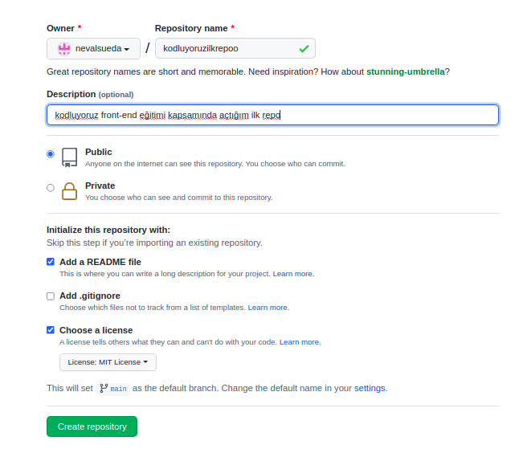

# **Kodluyoruz Ilk Repo**


Bu repo **[Kodluyoruz](https://kodluyoruz.org)** Front-End Eğitiminde oluşturduğumuz ilk repo. İçerisinde bir adet README dosyası, bir adet de index.html barındırıyor.



## Installation

Öncelikle projeyi clonelayın.

```bash
git clone https://github.com/nevalsueda/kodluyoruzilkrepo.git
```


## Usage

Projeyi clonladıktan sonra visual studio code programında açınız.

linux için:

```linux
cd kodluyoruzilkrepo
code .
```

## Contrubuting

PUll requestler kabul edilir. Büyük değişiklikler için, lütfen önce neyi değiştirmek istediğinizi tartışmak için bir konu açınız. 

## License

[MIT](https://choosealicense.com/licenses/mit/)


